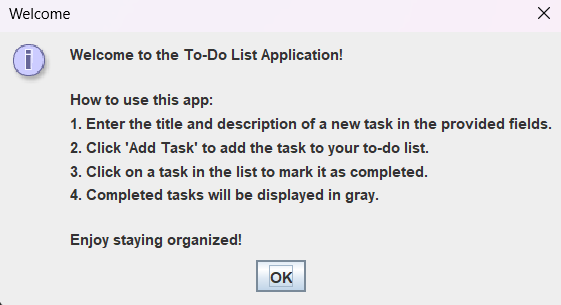
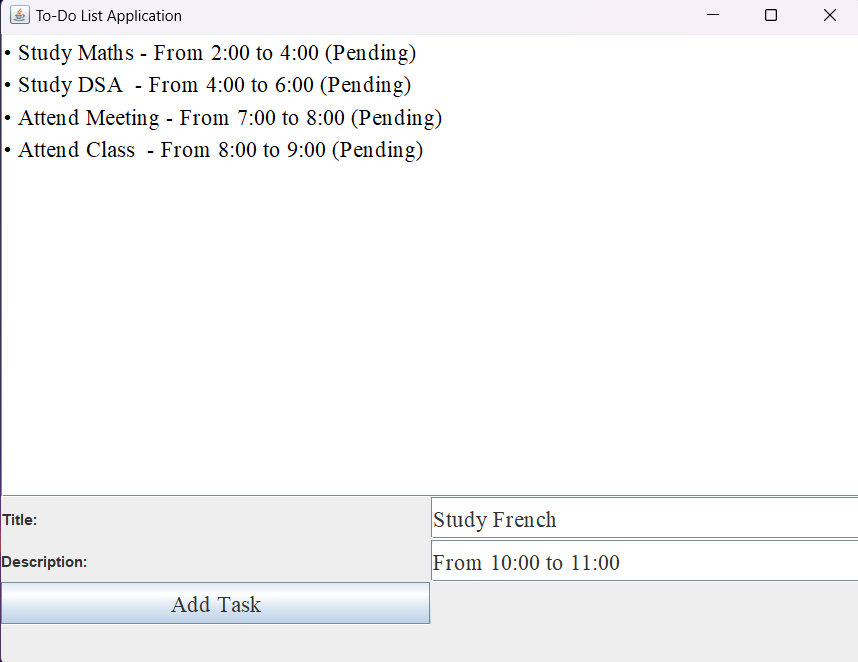
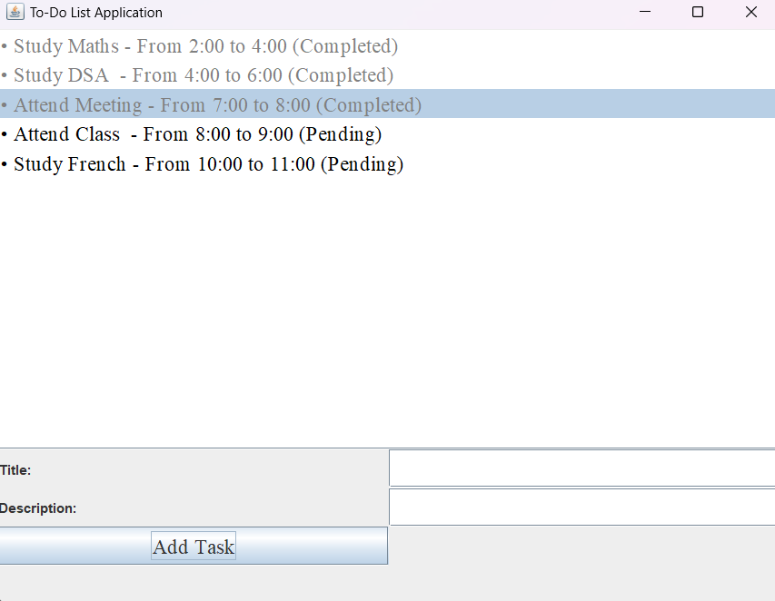

# To-Do List Application

## Overview
The To-Do List Application is a simple Java-based program that helps you manage your tasks. You can add tasks with a title and description, and mark them as completed by clicking on them in the list. Completed tasks are displayed in gray. This application includes a graphical user interface (GUI) built using Swing.

## Features
- Add new tasks with a title and description.
- View tasks in a list.
- Mark tasks as completed by clicking on them.
- Completed tasks are displayed in gray.
- Instructions provided on startup.

## Screenshots
### Main Interface


### Adding a Task


### Completed Task


## Installation and Running
1. Ensure you have Java installed on your machine.
2. Save each of the classes (`Task.java`, `Node.java`, `ToDoList.java`, `ToDoListApp.java`) in separate files.
3. Compile the Java files:
    ```sh
    javac Task.java Node.java ToDoList.java ToDoListApp.java
    ```
4. Run the application:
    ```sh
    java ToDoListApp
    ```

## Usage
When you first run the application, you will see a welcome message with instructions on how to use the app.

### Adding Tasks
1. Enter the title and description of a new task in the provided fields.
2. Click 'Add Task' to add the task to your to-do list.

### Marking Tasks as Completed
1. Click on a task in the list to mark it as completed.
2. Completed tasks will be displayed in gray.

## Contributing
If you have any suggestions or improvements, feel free to create a pull request or open an issue.
